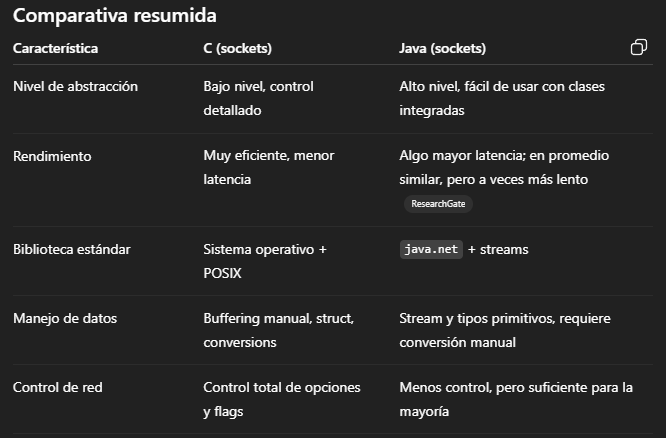
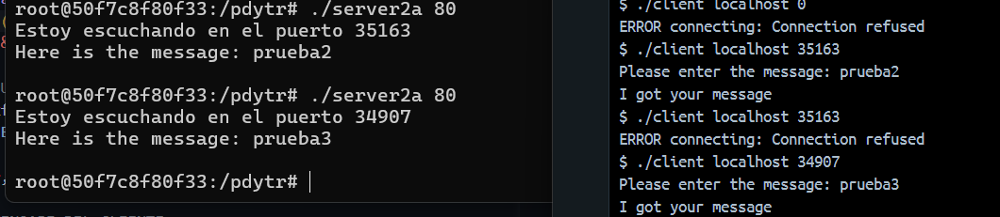
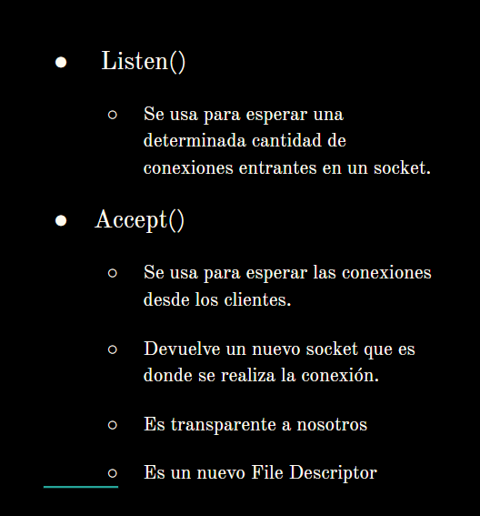

# Programación Distribuida y Tiempo Real - Práctica 1

> Explicación: [Presentación Sockets](https://docs.google.com/presentation/d/1_xWZFXiBqr4c0OSkn-6PywYsiKOY5Nhr_f3SaV_b3FY/edit?slide=id.g144820ab889_0_139#slide=id.g144820ab889_0_139)

## 1) Teniendo en cuenta la comunicación con sockets (puede usar tanto los ejemplos provistos como también otras fuentes de información, que se sugiere referenciar de manera explícita):
### a- Identifique similitudes y diferencias entre los sockets en C y en Java.
**Similitudes**:
    - Ambos usan Sockets TCP/IP para la comunicación de red. 
    - Ambos son compatibles con TCP/UDP y aplican los mismos principios de conexión

**Diferencias**: 
    - Abstracción: C posee un enfoque **bajo nivel** en el que se usan llamadas explícitas para el manejo de los sockets, buffers y errores, en cambio Java ofrece una API más amigable mediante clases Socket, ServerSocket, InputStream y OutputStream 
    - Tipos de datos: Java abstrae el orden de bytes e inicialización pero requiere convertir los datos manualmente (usando DataInputStream por ejemplo) pero en C se pueden transmitir directamente las estructuras. 

### b- ¿Por qué puede decirse que los ejemplos no son representativos del modelo c/s? Nota: corroborar con la clase donde se explica el modelo C/S.

No son representativos porque el servidor no realiza trabajo extra sobre la petición, sino que es un simple echo. Es una conexión simple entre dos sockets.

### c- ¿Qué cambio/s deberían hacerse para que “cliente” provisto funcione como “servidor” y el “servidor” provisto funcione como “cliente”? Nota: corroborar con la clase donde se explica el modelo C/S.

Sería necesario cambiar que el cliente se quede esperando un requerimiento y no sea el que inicie la comunicación. Para el caso del servidor, es necesario quitar el estado `listen` y que sea éste el que inicie la comunicación. Tiene que tener la capacidad de que sea concurrente. 

## 2) Desarrolle experimentos para quede claro que:
a - Aunque un proceso “servidor” programado en C haya obtenido un socket y hecho un `bind()` no va a haber ningún otro proceso que pueda hacer una conexión con ́el a menos que se haya hecho el `listen()`¿Por que este mismo experimento no podría hacerse programando en Java?

Porque el `listen()` se usa para esperar una determinada cantidad de conexiones entrantes en un socket. Al momento de crear un socket éste no posee identidad es decir, no posee dirección IP ni número de puerto, la instrucción `bind()` permite que el kernel sepa qué dirección asignar al socket para que los clientes sepan donde conectarse. `listen()` sin `bind()` funciona en el sentido de que el socket queda en modo pasivo, pero va a escuchar en un puerto aleatorio. En el caso de no realizar el `listen()` no se crea la cola de requerimientos y por lo tanto ningún cliente podrá completar la conexión TCP a ese puerto. 
Si se levanta `server2_a` se puede ver que el servidor queda escuchando pero el cliente no puede conectarse, nos salta `connection refused` pues desconoce el puerto. 
En Java no es posible realizar lo mismo porque una vez que se crea el `ServerSocket()` se crea el socket en conjunto con el puerto ya en escucha. Es decir no hay una etapa bind sin listen. El `accept()` del socket sólo se encarga de sacar un requerimiento de la cola de escucha que se generó cuando se creó el socket. 

En la imagen podemos ver que aleatoriamente se asigna un puerto y el cliente no puede conectarse. 

b - Un proceso “cliente” puede tener una conexión con el proceso “servidor” aunque el “servidor” no haya ejecutado la operación `accept()`.

Lo que probé fue dormir el proceso por 30 segundos y que se cierre el socket para ver el proceso cliente y qué es lo que ocurría: el requerimiento se encola y nunca es tomado por el servidor, mientras tanto el cliente se queda esperando; una vez que el socket se cierra el cliente lanza el error `ERROR reading from socket: Connection reset by peer`.

## 3) Modifique el código (programa C o Java o ambos) para que la cantidad de datos que se comunican sea de $10^1$, $10^2$, $10^3$, $10^4$, $10^5$ y $10^6$ y contengan bytes asignados directamente en el programa (sin leer de teclado ni mostrar en pantalla los datos del buffer). Tenga en cuenta que el valor de retorno de la llamada a `read(...)` tanto en C como en Java retornan la cantidad de bytes efectivamente leída y puede ser menor a la que se le indica/pedida como parámetro. Explique cómo verifica el correcto funcionamiento de lo desarrollado. El envío debe realizarse en una única llamada a la función correspondiente a menos que el valor de retorno indique que hay datos pendientes de envío.

## 5) ¿Podría implementar un servidor de archivos remotos utilizando sockets? Describa brevemente la interfaz y los detalles que considere más importantes del diseño. No es necesario implementar. 

Sí es posible realizar la transferencia de archivos, requeriría. 
Por ejemplo:
- `UPLOAD <nombre_archivo><cantidad_bytes>[ARRAY]`: en este caso el cliente envía el mensaje con la palabra clave que se indica, espera que el servidor responda con un `OK` o `ERROR`. si el servidor responde un `OK` prepara el buffer para la cantidad de bytes indicada y el cliente empieza con el envío de bytes. Por cada mensaje que se envía, el servidor controla y recibe hasta completar su búffer. Si no se completa envía al Cliente un `CONTINUE` tal que éste siga enviando. Una vez que se complete la cantidad de de bytes del servidor envía un `OK` para indicar que llegó completamente la información.   
- `DOWNLOAD <nombre_recurso>`: el cliente envía el mensaje con la palabra clave que se indica con el archivo que requiere. El servidor recibe el mensaje y busca en sus recursos si está presente <nombre_recurso>. En caso de no tenerlo envía un `ERROR` o sino envía un `OK <cantidad_bytes>` para que el cliente se prepare para recibir la cantidad de bytes indicada y responde con un `OK`. Ambos se encuentran preparados para la transferencia de datos: servidor inicia el envío de bytes. Cliente recibe todos los mensajes. Esto también podría hacerse que en un sólo mensaje se envíe todos los bytes de esta forma `OK <cantidad bytes> {bytes}` o un `ERROR`. 
Se puede complejizar o hacer más fácil uwu  
- `DELETE <nombre_recurso><cantidad_bytes>[ARRAY]`:
- `UPDATE <nombre_recurso><cantidad_bytes>[ARRAY]`:

## 6)  Explique y justifique brevemente ventajas y desventajas de un servidor con estado respecto de un servidor sin estados. Considere las respuestas de diferentes asistentes de IA y analice
a) Similitudes y diferencias entre las respuestas de los diferentes asistentes de IA.

### ChatGPT Plus 5
Qué significa?
- **Con estado (stateful)**: el servidor recuerda información de la sesión/conversación (progreso, carrito, autenticación) entre requests.
- **Sin estado (stateless)**: cada request es autosuficiente; el servidor no guarda contexto entre llamadas.

**Ventajas de con estado por sobre los servidores sin estado**: 
- Menos sobrecarga por request: no hace falta reenviar todo el contexto en cada llamada -> menor latencia y ancho de banda.
- Flujos multipaso más simples: protocolos de varias capas, transacciones largas o conversaciones se modelan más naturalmente porque el servidor recuerda el progreso. 
- Cachés por usuario/sesión más efectivas: memorizar resultados más específicos del cliente y reducir cómputo repetido.

**Desventajas de con estado por sobre los servidores sin estado**:
- Escalado horizontal más difícil: es necesario replicar/compartir estado, complica el balanceo. 
- Menor tolerancia a fallos: si cae un nodo, se pierde la sesión.
- Mayor consumo por cliente: el estado residente ocupa memoria y limita la concurrencia máxima. 
- Idempotencia y depuración más complejas: efectos por estado implícito hacen más fácil tener side effects inesperados.

**¿Cuándo conviene cada uno?**
- **Con estado**: sesiones interactivas y continuas donde el contexto cambia rápido y es costoso retransmitirlo (juegos, trading de baja latencia, chats persistentes, protocolos orientados a conexión).
- **Sin estado**: APIs web y microservicios que priorizan escalabilidad, resiliencia y simplicidad operativa (cualquier nodo puede atender cualquier request).

### Gemini
**Ventajas de un servidor con estado**:
- Personalización y experiencia de usuario.
- Reducción de datos en peticiones: al no tener que enviar toda la cada solicitud, el tamaño de las peticiones menor, loque puede mejorar la latencia y el consumo de ancho de banda. 
- Lógica de negocio simplificada: la lógica de la aplicación puede ser más simple porque el contexto de la sesión está disponible para solicitud. 

**Desventajas de un servidor con estado**:
- Escalabilidad limitada: al depender de la información de la sesión es dificil escalar horizontalmente. Si un cliente cambia de servidor la información de su sesión se pierde. Lo que requiere mecanismos complejos como sesiones compartidas. 
- Tolerancia a fallos: si un servidor con estado falla, la información de la sesión de todos los clientes que estaban conectados a él se pierde.
- Gestión de recursos copleja: el servidor debe asignar recursos de memoria parap cada sesión activa, lo que puede llevar a problemas de memoria y a una gestión más compleja. 

**Ventajas de un servidor sin estado**:
- Escalabilidad: son más fáciles de escalar horizontalmente. Ideal para aplicaciones con un alto volumen de tráfico. 
- Fiabilidad y tolerancia a fallos: la caída de un servidor no afecta a las sesiones de los clientes. 

**Desventajas de un servidor sin estado**:
- Sobrecarga de datos en peticiones: cada solicitud debe contener toda la información necesaria para que el servidor la procese, la que puede aumentar el tamaño de la petición y el consumo de ancho de banda. 
- Mayor compmlejdad en el cliente: el cliente es responsable de manteener el estado de la sesión y de enviarlo con cada solicitud. 
- Experiencia de usuario menos fluida: para tareas que requierem múltiples pasos, el cliente tiene que gestionar y enviar el estado en cada paso.

### Sobre Copilot y Claude
Explican maso lo mismo pero más simple y claro. GPT se pasa en técnicom tuve q depurar para que se entienda. 

b) Elabore su propio análisis.
Siempre depende del objetivo de la aplicación y los recursos que se tengan para poder atender a la demanda. Si el objetivo está en priorizar la experiencia de usuario y la personalización es conveniente que mantener un servidor con estado en el cual se tenga en cuenta las preferencias del usuario, si en cambio el objetivo es, por ejemplo, ofrecer información es más conveniente un servidor sin estado. Se debe tener en cuenta también que el costo de cómputo es menor al costo de acceso a memoria por lo que es necesario también un equilibrio.  

---

# Anotaciones 

## C: El ciclo socket → bind → listen → accept

En el servidor TCP en C ( `server.c`):

- `socket()`
Crea un descriptor de archivo para un socket, pero todavía no está asociado a nada.

- `bind()`
Asocia ese socket a una dirección IP y un número de puerto. 
→ Esto garantiza que si alguien intenta conectarse a IP:puerto, el sistema operativo sabe a qué socket referirse.

- `listen()`
Marca el socket como pasivo (aceptando conexiones). Además, crea una cola de backlog donde el kernel acumula las conexiones entrantes hasta que la aplicación las atienda.
→ Si no hacés `listen()`, aunque hayas hecho `bind()`, el kernel rechaza los intentos de conexión porque ese puerto no está “escuchando”.

- `accept()`
Se bloquea esperando un cliente. Cuando llega uno, el kernel lo saca de la cola de backlog y devuelve un nuevo descriptor de socket (newsockfd).
→ Ese descriptor es el que usarás para leer y escribir con ese cliente en particular.
→ El socket original (sockfd) sigue escuchando y puede aceptar otros clientes.

## Sobre servidores statelles o stateful
- https://medium.com/@ahmedossama22/stateless-vs-stateful-servers-with-examples-6e37223c028f

- https://www.redhat.com/es/topics/cloud-native-apps/stateful-vs-stateless
