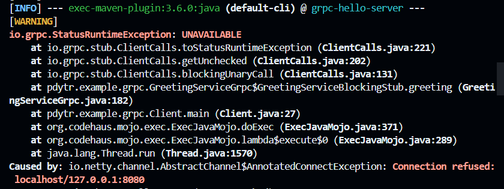
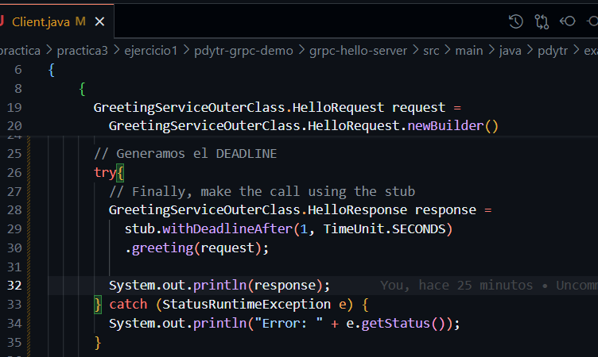
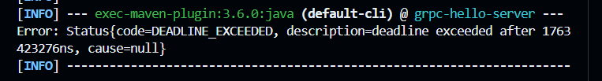

1.
a. Introduzca cambios mínimos, como la inclusión de `exit()`, para provocar situaciones donde no se reciban comunicaciones o no haya un receptor disponible. Agregar screenshots de los errores encontrados.

En este caso el `exit` lo puse antes luego de iniciar el server en `App.java`, del lado del cliente se observa lo siguiente:  


b. Este uso lo saqué de:  https://github.com/grpc/grpc-java/tree/master/examples/src/main/java/io/grpc/examples/deadline
Conceptos: https://grpc.io/docs/guides/deadlines/

**Modificación del lado del cliente**


**Modificación del lado del server en la función**


**OUTPUT CLIENTE**


### Ventajas:
- Los deadlines permiten a los clientes establecer un límite de tiempo para esperar una respuesta del servidor. Esto evita que las solicitudes queden bloqueadas indefinidamente en caso de problemas como:
    - Retrasos en el servidor.
    - Problemas de red.
    - Sobrecarga del sistema.

- Mejora de la experiencia del usuario: Al usar deadlines, los clientes pueden manejar errores de manera más predecible y proporcionar retroalimentación al usuario (como mensajes de error o reintentos), en lugar de dejarlo esperando sin respuesta.

- Optimización de recursos: Cuando se excede un deadline, gRPC cancela automáticamente la solicitud en el cliente y el servidor. Esto libera recursos en ambos extremos, evitando que se procesen solicitudes que ya no son relevantes.

2. Describa y analice los distintos tipos de APIs que ofrece gRPC. Con base en el análisis, elabore una conclusión sobre cuál sería la mejor opción los siguientes escenarios: 
a. **Un sistema de pub/sub**: Pensarlo como server streaming. Plantear el esquema, contexto. 
b. **Un sistema de archivos FTP** (bidireccional, hay que definir los servicios): Se conoce que el protocolo requiere dos canales: una de datos y la otra de control. Para el caso de control se usaría un canal de RPC simple de modo que ya sea el servidor/cliente que se comunique por las operaciones que indican. Para el caso del canal de datos ya sea de carga o descarga habrá un flujo unilateral de datos por lo tanto se usaría Client Streaming RPCs o Server Streaming RPCs. 

**Nota**: Desarrolle una conclusión fundamentada considerando los siguientes aspectos para ambos escenarios (pub/sub y FTP):
- **Escalabilidad**: ¿Cómo se comporta cada API en situaciones con múltiples clientes y conexiones simultáneas?
- **Consistencia vs Disponibilidad**: ¿Qué importancia tiene mantener la consistencia de los datos frente a la disponibilidad del sistema? 
- **Seguridad**: ¿Qué mecanismos de autenticación, autorización y cifrado se deben utilizar para proteger los datos y las comunicaciones?
- **Facilidad de implementación y mantenimiento**: ¿Qué tan fácil es implementar y mantener la solución para cada API? 

#### Caso sistema de pub/sub
> Sobre la arquitectura: https://www.geeksforgeeks.org/system-design/what-is-pub-sub/
Contexto: si nos paramos del lado del servidor, el cliente está conectado al canal pero el servidor posee N conexiones con los diferentes N clientes, el `.proto` debiese ser apta para conexiones server streaming. Si nos paramos del lado del cliente, el publisher enviaria información de forma periodica para mantener actualizados los tópicos. 
Un sistema pub/sub requiere que la información nueva de un tópico sea informado de forma inmediata a los subscribers por lo cual sacrificar aspcectos de consistencia tienen menor relevancia que de disponibilidad. 


#### Caso sistema FTP 
Como las comunicaciones son continuas para la subida/descarga de archivos en el servidor es necesario usar bidirectional streaming dado que una vez que se abren los canales de comunicación y datos, se mantiene un flujo de mensajes enviando comandos y con carga/descarga de archivos. 
La consistencia es relevante en este sistema para que se mantenga la integridad de los archivos subidos, por lo tanto la disponibilidad, en ese momento, es preferible dejarla de lado hasta finalizar la operación.  

> Sobre la seguridad: gRPC ofrece _SSL/TLS_, _ALTS_ y _Token-Based authentication with Google_. 
---

## Ejercicio 2: parte teorica

> [Documentación oficial sobre tipos gRPC](https://grpc.io/docs/what-is-grpc/core-concepts/)

### Tipos de API de gRPC 
#### Unary RPC 
El cliente envia a una sóla solicitud al servidor y obtiene una única respuesta, como el llamado a una función común. 
```
Cliente -> Solicitud -> Servidor
Cliente <- Respuesta <- Servidor
```

#### Server Streaming RCPs 
El cliente envía una solicitud al servidor y éste responde con un flujo de datos (múltiples mensajes). gRPC garantiza el orden de los mensajes dentro de una llamada gRPC individual.
```
Cliente -> Solicitud -> Servidor
Cliente <- Respuesta 1 <- Servidor
Cliente <- Respuesta 2 <- Servidor
Cliente <- Respuesta N <- Servidor
```

#### Client Streaming RPCs 
El cliente envía un flujo de datos (múltiples mensajes) al servidor. Una vez que el cliente finaliza la escritura de los mensajes espera a que el servidor lea y retorne una respuesta. gRPC garantiza el orden de los mensajes dentro de una llamada gRPC individual. 
```
Cliente -> Solicitud 1 -> Servidor
Cliente -> Solicitud 2 -> Servidor
Cliente -> Solicitud N -> Servidor
Cliente <- Respuesta <- Servidor
```

#### Bidirectional Streaming RPCs 
Los dos lados envían un flujo de datos entre sí. Los dos lados del flujo operan independientemente, de esta forma, los clientes y servidor pueden leer y escribir en el orden que deseen. El orden de los mensajes se preserva en cada flujo. 

| Tipo de API              | Solicitudes del Cliente | Respuestas del Servidor | Ejemplo de Uso               |
|--------------------------|-------------------------|-------------------------|------------------------------|
| RPC Simple               | 1                       | 1                       | Obtener detalles de un usuario |
| Streaming del Servidor   | 1                       | Múltiples               | Transmitir actualizaciones    |
| Streaming del Cliente    | Múltiples               | 1                       | Subir un archivo              |
| Streaming Bidireccional  | Múltiples               | Múltiples               | Chat en tiempo real           |