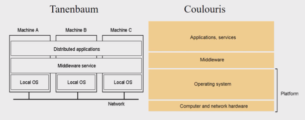

# Programación Distribuida y Tiempo Real - Teoría - Clase: 1 

## Definiciones 
- Tenenbaum: "Colección de computadoras independientes que dan al usuaio la impresión de constituir un único sistema coherente"
- Liu: "Un sistema distribioda es una colección de computadores independientes conectados mediantes una red pero que son capaces de colaborar para una tarea" 
- Coulouris: "... aquel en el que los componentes localizados en computadores [...] comunican y coordinan sus acciones únicamente mediante el paso de mensajes"

> Aunque los componentes son autónomos colaboran para ofrecer una vista unificada a los usuarios lo que es abstracto al usuario

Colouris presenta _**Middleware Service**_: capa de software que se sitúa lógicamente entre una capa de alto nivel y una capa subyacente (sistemas operativos y recursos de comunicación básicos). Su objetivo principal es proporcionar transparencia de distribución. 

## Evolución 
La progresión de estos sistema ha estado motivada por:
- **Redes Locales**: redes que permitieron interconectar cientos de máquinas dentro de un mismo lugar con una alta velocidad de trnasferencia de datos. El enfoque inicial fue compartir hardware como impresoras y recursos (ej. almacenamiento) entre las PCs. Se estableció el modelo Cliente/Servidor y se desarrollaron los primeros protocoles de redes locales y APIs. 
- **Salto al exterior de las redes** locales: esto fue posible gracias al desarrollo del protocolo de Internet (IP), la idea fue implementar el cómo comunicar un dato de una red local a otra red local y a qué proceso asociarlo (puertos) 
- El salto de las aplicaciones sobre IP y las aplicaciones web: popularización de HTTP, servidores web y navegadores/buscadores. Una razón clave para su adopción masiva es la capacidad de actualizar y mantener las aplicaciones web sin necesidad de distribuir e instalar software en potencialmente miles de computadoras cliente.
- El _retroceso_ de las aplicaciones móviles: se retorna la idea de tener que instalar la aplicación y dependencia de éstas a no usar las webapps. La evolución culmina en un modelo Cliente/Servidor "casi plano". Esto refleja una tendencia hacia arquitecturas descentralizadas donde los procesos tienen roles más simétricos, actuando tanto como clientes como servidores.

