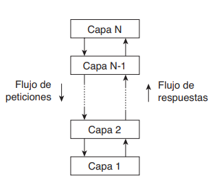
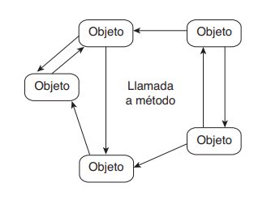
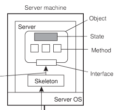
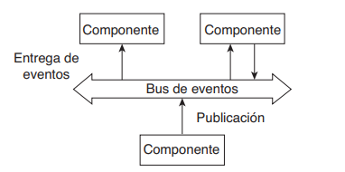
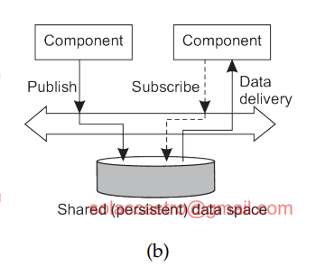

# Programación Distribuida y Tiempo Real - Teoría - Clase 10: Estilos arquitecturales

Para nuestro estudio, la idea de estilo arquitectónico es importante. Tal estilo se formula en términos de componentes, la forma en que los componentes interactúan entre sí, el intercambio de datos entre los componentes y, por último, en cómo es que estos elementos se configuran juntos en un sistema.
Un **componente** es una unidad modular con las _interfaces_/ requeridas bien definidas; dicha unidad es reemplazable dentro de su ambiente. El de conector, el cual generalmente se describe como un mecanismo que media la comunicación, coordinación o cooperación entre componentes (Mehta y cols., 2000; y Shaw y Clements, 1997). Por ejemplo, un conector puede formarse por los medios disponibles para hacer llamadas a procedimientos (remotos), paso de mensajes, o flujo de datos.

Por medio de componentes y conectores podemos lograr varias configuraciones, las cuales se
han clasificado en estilos arquitectónicos. Varios estilos ya están identificados y los más importantes para sistemas distribuidos son:

1. **Arquitecturas en capas**: el componente de la capa $L_i$ se le permite llamar a componentes de la capa subyacente $L_{i-1}$, pero no del resto de capas. El control generalmente fluye de capa a capa: las peticiones se mueven hacia abajo en la jerarquía mientras que los resultados se mueven hacia arriba.
   
2. **Arquitecturas basadas en objetos**: pensar todo el sistema distribuido como objetos que se encuentran distribuidos, cada objeto es un componente y éstos se conectan a trvés de un mecanismo de llamadas a procedimientos (remotos). Proporcionan una forma de _encapsulamiento_ de los datos (estado de un objeto) y las oepraciones que se pueden reazliar sobre esos datos en una sola entidad. La interfaz ofrecida por un objeto oculta los detalles de implementación.
   
   Esta separación entre las interfaces y los objetos que implementan dichas interfaces nos permite ubicar una interfaz en una máquina, mientras que el objeto en sí reside en otra máquina. Esta organización, que se muestra en la Figura 2.6, se conoce comúnmente como un **objeto distribuido**.
   

3. **Arquitecturas centradas en recursos**: se puede considerar un sistema distribuido como una gran colección de recursos que son gestionados individualmente por componentes. Los recursos pueden ser añadidos o eliminados por aplicaciones (remotas), y de la misma manera, pueden ser recuperados o modificados. Este enfoque ha sido ampliamente adoptado para la Web y se conoce como Representational State Transfer (REST). Características clave:
   1. Los recursos son identificados a través de un esquema de nombres único.
   2. Todos los servicios ofrecen la misma interfaz.
   3. Los mensajes enviados hacia o desde un servicio están complementamente autodescriptos.
   4. Después de ejecutar una operación en un servicio, ese componente olvida todo sobre el cliente.
4. **Arquitecturas basadas en eventos**: los procesos se comunican a través de la propagaión de eventos, los que opcionalmente transportan datos. Para sitemas distribuidos, la propagación de eventos se ha asociado con el sistema **Publish/Subscribe**: los procesos publican eventos después de los cuales el middleware asegura que sólo aquellos procesos suscritos a tales eventos los recibirán. La principal ventaja de los sistemas basados en eventos es que los procesos están libremente acoplados, no necesitan referirse uno a otro explícitamente.
   Contiene componentes que generaran eventos (_publicadores_) y componentes que manejan eventos (_suscriptores_), todo el sistema se construye a partir de estos dos.
   El estilo de Publicación/Suscripción es notable por las formas en que desacopla los componentes, Los componentes no interactúan directamente entre sí, sino con el middleware o servicio de transporte de eventos. Esto orienta la identificación de requerimientos.

Los publicadores son los componentes del sistema que generan eventos. Suscriptores son los componetes que manejan o reciben eventos, expresan itnerés en un conjunto de eventos mediantes suscripciones. La interfaz es donde se definen los eventos y las características de los eventos, se accede a la comunicación que es unidireccional (el que publica envía, el que suscribe recibe). La comunicación es asincrónica en el sentido en el que el publica se desentiende cómo se maneja la transmisión del evento publicado.
Las interacciones entre componentes no ocurren, únicamente entre cada componente y el middleware o servicio de transporte de eventos (desacople referencial). Para asegurar que un evento publicado llegue al componente suscrito es necesario que ambos estén activos al mismo tiempo.

| Architecture Style    | Componente                          | Interface                                      | Organizacion                                                | Comunicacion                       |
| --------------------- | ----------------------------------- | ---------------------------------------------- | ----------------------------------------------------------- | ---------------------------------- |
| Layered architectures | capas                               | cliente/servidor                               | cliente/servidor, niveles de abstracción                    | requerimientos y respuestas        |
| objetos distribuidos  | metodos                             | distribuir los objetos en todo el sistema      | métodos                                                     |
| acceso a recursos     | manejadores, servidores de recursos | servicios, los mismos para atodos, sin estados | distribuir manejadores/recursos en el sistema               | interfaces, servicios              |
| Publish/Subscribe     | procesos, modulos o hilos           | publicación y suscripción de eventos           | distribuir procesos y publicación y notificación de eventos | definidas por el middleware de p-s |

### Anexo: más sobre P/S

#### Desacoplamiento en P/S

El estilo P/S es valorado por su capacidad para desacoplar (relajar las dependencias) a los procesos, lo que facilita la construcción de sistemas distribuidos a gran escala.

1. Desacoplamiento Referencial o en Espacio (Space Decoupling): Los procesos no necesitan referirse explícitamente entre sí. El publicador no necesita saber quiénes son los destinatarios del mensaje; solo envía el evento a un tema o según su contenido. El middleware se encarga de la coincidencia y el enrutamiento.
2. Desacoplamiento Temporal (Time Decoupling): En un sistema de P/S puro, los procesos pueden estar acoplados en el tiempo, lo que significa que la mayoría de los sistemas de P/S requieren que los procesos que se comunican estén activos al mismo tiempo para que la comunicación se lleve a cabo. Sin embargo, el desacoplamiento temporal es posible si el sistema ofrece persistencia de eventos. En estos casos, el middleware guarda los elementos de datos, permitiendo que el emisor o el receptor no estén activos durante la transmisión.

##### Alternativa al time coupling
El desacoplamiento temporal es posible si el sistema ofrece **persistencia de eventos**. En estos casos, el middleware guarda los elementos de datos, permitiendo que el emisor o el receptor no estén activos durante la transmisión. 
La idea central es que los procesos se comuniquen mediante tuplas (registros de datos estructuras, similar a una fila en una database table). Pensarlo como una _base de datos compartida_  de eventos sucedidos. 

#### Características

| **Característica**          | **Descripción en P/S**                                                                |
| --------------------------- | ------------------------------------------------------------------------------------- |
| **Componentes**             | Publicadores y Suscriptores (mediante procesos, módulos o hilos).                     |
| **Interfaces**              | Publicación y Suscripción de eventos (definidas por el middleware).                   |
| **Organización**            | Distribución de procesos más el servicio P/S.                                         |
| **Patrón de Comunicación**  | Uno-a-muchos (1-to-many).                                                             |
| **Acoplamiento en Espacio** | Desacoplado (Referencialmente desacoplado, los componentes no se conocen entre sí).   |
| **Acoplamiento en Tiempo**  | Generalmente Acoplado (o Posiblemente desacoplado si se usa persistencia de eventos). |
| **Intención Principal**     | Diseminación de información.                                                          |
| **Escalabilidad**           | Posible (gracias al desacoplamiento).                                                 |

> Desacoplado en el espacio. Acoplado en el tiempo. 

> Hay middleware q son para comunicaciones, en el ccaso de P/S implementación de comunicación.En el casode un navegador web con un servidor web no hay middleware. 

> El ejemplo para la figura 2.16e está pensado para el ejemplo clásico de las base de datos distribuidas (teoricas)

> Los juegos son el clasico ejemplo de user app/app database. 