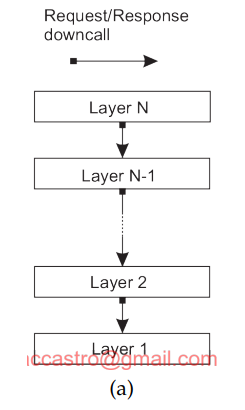
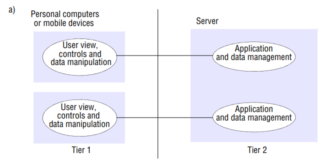
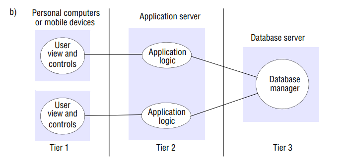
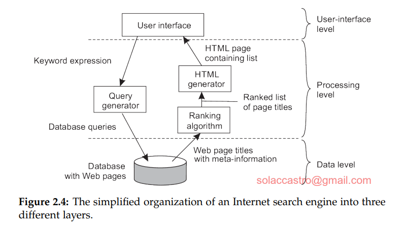

# Programación Distribuida y Tiempo Real - Teoría - Clase 11: Estilos arquitecturales -> CAPAS 

## Idea básica
Los componentes se organizan de manera jerárquica. Una capa dada hace uso de los servicios ofrecidos por la capa inmediatamente inferior.

## Flujo de control
En un modelo de capas puro, el control generalmente fluye de capa a capa. Las peticiones se mueven hacia abajo en la jerarquía, y los resultados se mueven hacia arriba. Típicamente, un componente en la capa $L_j$ solo puede realizar una llamada descendente (downcall) a un componente en la capa inferior $L_i (i<j)$, esperando una respuesta. Las llamadas ascendentes (upcalls) son solo para casos excepcionales.

## Estructuras 

### Dos capas (two-tier architecture)
Una capa es sólo cliente, y la otra es sólo servidor. 

La ventaja de este esquema es la baja latencia en términos de interacción ya que únicamente el intercambio de mensajes serían para invocar una operación. La desventaja es que la lógica de la aplicación queda expuesta, es decir, partes de la lógica pueden ser invocadas directamente de otras partes. 

### Tres capas (three-tier architecture)
Una capa sigue siendo cliente, la capa intermedia que es servidora de la interfaz de usuario y otra capa es sólo servidor (base de datos). 
La capa intermedia desempeña un doble rol esencial:
- Actúa como Servidor para la capa de interfaz de usuario.
- Actúa como Cliente para la capa de base de datos (persistente).
Los niveles lógicos: 
1. Nivel de Interfaz de Usuario (UI): Contiene todo lo necesario para interactuar directamente con el usuario. En la implementación de tres capas, esta capa suele ser solo cliente.
2. Nivel de Procesamiento: Generalmente contiene la funcionalidad principal o "lógica de negocio" de la aplicación. Esta capa es "intermedia".
3. Nivel de Datos: Administra los datos reales (bases de datos o sistemas de archivos). En esta estructura, esta capa es solo servidor.

Sobre el procesamiento en Figura 2.16 (3era ed.) o Figura 2.5 (2da ed.)
• Cliente Delgado (Thin Client): El cliente se utiliza principalmente como una terminal sin almacenamiento local. El software del cliente no realiza más procesamiento que el necesario para la presentación de la interfaz. Las soluciones del cliente delgado son populares porque facilitan las tareas de administración de sistemas.
• Cliente Gordo (Fat Client): Implica mover parte de la aplicación hacia el front end (cliente). Este enfoque busca la mayor distribución de la carga entre clientes, aumentar la capacidad de procesamiento de los clientes y conseguir mejores tiempos de respuesta/interacción con el usuario.

Cuando la funcionalidad del servidor crece, el grueso del procesamiento genera sobrecarga o más requerimientos llegarán por lo tanto afectarán a la latencia. Entonces, al aumentar la funcionalidad no hay que dejar de lado de icnrementar la capacidad de comunicación del servidor. 

> Desde una perspectiva de administración de sistemas, tener lo que se como clientes gordos (servidor liviano) no es lo óptimo

## Capas: ¿muchas?
Dividir más capas implica subdividir la capa intermedia viste anteriormente. Siempre que hayan más capas, habría más modularización. Más capas, más interfaces, más datos a transferir, mayor interacción y sincrconización: mayores problemas de rendimiento. 