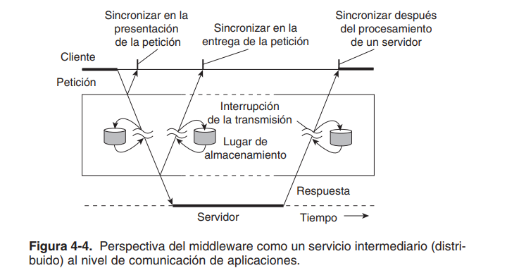

# Programación Distribuida y Tiempo Real - Teoría - Clase 12: Comunicaciones

La comunicación en sistemas distribuidos (SD) se refiere principalmente al intercambio de datos entre procesos o módulos. Aunque se basa intrínsecamente en las redes de comunicaciones y sus protocolos subyacentes (que son reglas que rigen el formato, contenido y significado de los mensajes), el enfoque de la programación distribuida se sitúa en un nivel de abstracción superior, cercano a la propia aplicación.

## Aspectos importantes 
- **Confiabilidad**: un sistema de comunicación confiable idealmente asegura la ausencia de pérdida de mensajes y el mantenimiento del orden.
- **Sincronismo**: se relaciona con el concepto general de coordinación temporal. 
- **Persistencia**: la persistencia es fundamental para el desacoplamiento en el tiempo, si la comunicación es persistente la aplicación remitente no necesita seguir ejecutándose, ni la aplicación destinataria necesita estar activa, para que el mensaje sea entregado. 
- **Manejo de los datos**: la transferencia de datos implica enfrentar la heterogeneidad (diferencias en la representación de datos entre máquinas). Para gestionar esto, son necesarias técnicas de serialización y codificación "externa" de los datos. 

## Tipos de comunicación

Con **comunicación persistente**, el middleware de comunicación almacena el mensaje que ha sido presentado para transmitirse el tiempo que tome entregarlo al destinatario. Como consecuencia, no resulta necesario que la aplicación remitente continúe con la ejecución después de presentar el mensaje. De igual manera, la aplicación destinataria no necesita estar en ejecución cuando el mensaje se presenta
Por contraste, con la **comunicación transitoria**, el sistema de comunicación almacena un mensaje sólo mientras las aplicaciones remitente y destinataria se ejecutan. El middleware no puede entregar un mensaje debido a una interrupción en la transmisión, o debido a que el destinatario no está activo de momento, y simplemente será descartado. En general, todos los servicios de comunicación al nivel de transporte sólo ofrecen comunicación transitoria.
La característica principal de la comunicación asíncrona es que el remitente continúa inmediatamente después de que ha pasado su mensaje para transmisión. Esto significa que el mensaje es almacenado (de modo temporal) inmediatamente bajo la supervisión del middleware. Con la comunicación sincrónica, el remitente es bloqueado hasta que se sabe que su petición es aceptada. Básicamente existen tres casos en que puede ocurrir la sincronización. Primero, el remitente puede ser bloqueado hasta que el middleware notifica que va a encargarse de la transmisión de la petición. Segundo, el remitente puede sincronizarse hasta que su petición se ha entregado al destinatario. Tercero, la sincronización puede ocurrir al dejar que el remitente espere hasta que su petición se
haya procesado por completo, es decir, hasta que el destinatario devuelva una respuesta.

>  la comunicación transitoria con sincronización luego de que una petición ha sido completamente procesada también se utiliza ampliamente. Este esquema corresponde a las llamadas a procedimientos remotos.