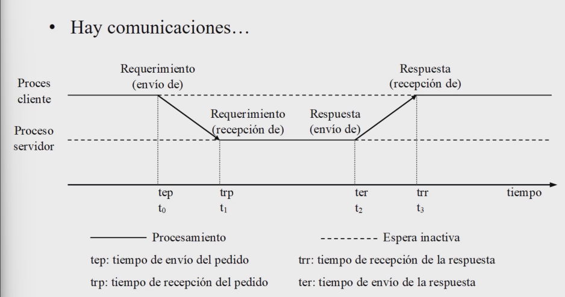

# Programación Distribuida y Tiempo Real - Teoría - Clase 2: Procesamiento Cliente - Servidor

# Sistemas Cliente/Servidor (c/s)
Este modelo define una forma de interacción entre dos tipos principales de procesos, independientemente de la cantidad de máquinas físicas involucradas. 
Los procesos de un sistema distribuido se dividen lógicamente en dos grupos:
- Un **servidor** es un proceso que implementa y ofrece un servicio específico (por ejemplo, un servicio de archivos o de base de datos).
- Un **cliente** es un proceso que solicita un servicio a un servidor, enviándole una petición y esperando posteriormente una respuesta.

## Esquemas temporales de procesamiento 

- Para el cliente: cuando un proceso requiere un recurso, pide el requerimiento al sistema que pueda proveerle ese recurso hasta que llegue la respuesta y pueda continuar. Un proceso cliente no frena su ejecución hasta que requiera un recurso que no dispone. 

- Para el servidor: el proceso en general no hace nada por sí mismo. No tiene una tarea hasta que le llegue un requerimiento. Se encarga de gestionar recursos que no usa para ofrecer a otros para cumplir con los requerimientos. Asigna los recursos cuando los procesos lo necesitan. Siempre debbe proveer una respuesta a cada requerimiento (ya sea asignandole el recurso o no). 

## Comunicación
En sistemas distribuidos es necesario la **comunicación**. 

## Características del modelo
1. Modelo independiente de la cantidad de máquinas/procesos: se basa en la interacción de dos tipos de procesos clientes (activos) y servidores. 
2. Rol activo del cliente: estos procesos inician la comunicación mediante una petición. 
3. Los servidores son pasivos en la interacción pues dessconoce cuándo llegará una petición. 
4. Los clientes son los que usan o necesitan recursos que requieren al servidor. 
5. Los servidores administran aquellos recursos. 
6. Visión de los recursos: 
    - clientes: visión limitada a los recursos que necesitan 
    - servidores: visión amplia del estado de todos los recursos que administran. 
8.  Independencia en la transferencia de información: normalmente asuman que hay un sistema de transporte de los requerimientos que no implementan, sólo son usuarios. 
9. Interfaz bien definida: 
    - cómo se solicita un servicio y qué datos son necesarios al enviar una petición
    - cómo se retorna la respuesta a un cliente y qué datos se le devuelven como resultado del servicio solicitado. 

> El modelo cliente servidor es casi la forma lógica de procesamiento al menos en el inicio de los sistemas distribuidos, no se hace más que seguir el modelo de interacción de procesos de usuario con los sistemas operativos y las ideas más conceptuales de los protocolos de comunicación. 

# Sockets 
Es necesario no confundir que el uso de sockets signifique que se está usando el modelo cliente/servidor porque es _comunicación_. 
La creación de la conexión sí es parecida al modelo cliente/servidor, pero es necesario entender que si hay conexión TCP no implica que se esté usando el modelo C/S, ni tampoco al revés ya que no siempre la comunicación es mediante sockets lo que importa es la interfaz. 

