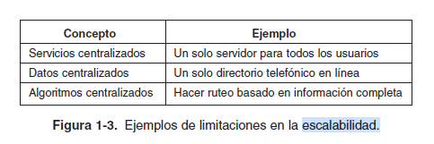
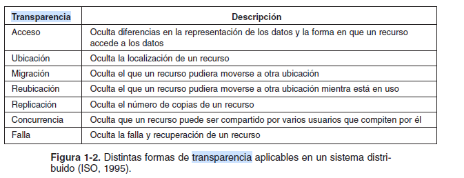

# Programación Distribuida y Tiempo Real - Teoría - Clase 3: Características generales de los sistemas distribuidos 

## Características

### Sin estado global
Cualquier sistema de cómputo centralizado tiene la posibilidad de ser conocido en su totalidad en cualquier instante de tiempo pero en los sistemas distribuidos esto no es posible, sí se pueden conocer detalles o información sobre un periodo pero no sobre el estado global de todo el sistema. 

### Concurrencia y recursos compartidos (desafío para Coulouris)
Esta es una característica clave que se relaciona con el acceso simultáneo de varios procesos a recursos compartidos. 

### Escalabilidad (objetivo para Tenenbaum)
La escalabilidad es un objetivo primordial en los sistemas distribuidos. La idea es que un sistema pueda crecer sin problemas cuando se le añaden recursos. También es importante la idea de que el sistema "no crezca" (analogía al costo de usar tiempo en cloud). 
La escalabilidad de un sistema se puede medir de acuerdo con al menos tres dimensiones:
- escalable con respecto a su tamaño: que se puede agregar fácilmente usuarios y recursos.
- escalable geográficamente: usuarios y recursos pueden radicar muy lejos unos de los otros.
- escalable administrativamente: fácil de manejar incluso si involucra muchas organizaciones administrativas diferentes.

Por ahora, existen básicamente sólo tres técnicas para efectuar el escalamiento: **ocultar las latencias de comunicación**, **distribución** y **replicación**.
Ocultar las latencias de comunicación es importante para lograr la escalabilidad geográfica. La idea básica es simple: intentar evitar lo más posible la espera por respuestas de peticiones remotas (y potencialmente distantes) de servicios. Por ejemplo, cuando requerimos un servicio de una máquina remota, una alternativa durante la espera de respuesta del servidor es hacer otras cosas útiles del lado de la máquina que realiza la petición. En esencia, esto significa la construcción de la aplicación que hace las solicitudes de tal manera que solamente utilice comunicación asíncrona.
Cuando obtenemos respuesta, interrumpimos la aplicación e invocamos un manejador (handler) especial para completar la petición hecha con anterioridad.
La distribución significa tomar un componente, dividirlo en partes más pequeñas, y en consecuencia dispersar dichas partes a lo largo del sistema. Un ejemplo excelente de distribución es el servicio de nombres de dominio (DNS) usado en internet.
Si consideramos que los problemas de escalabilidad aparecen con frecuencia en forma de degradación del rendimiento, por lo general es una buena idea **replicar** los componentes a lo largo del sistema distribuido. La replicación no solamente incrementa la disponibilidad, sino que además ayuda a balancear la carga entre los componentes para obtener un mejor rendimiento. Además, en los sistemas geográficos dispersados ampliamente, tener una copia cercana puede ocultar muchos de los problemas de latencia de comunicación mencionados anteriormente. Debido a que por ahora tenemos copias múltiples de un recurso, modificar una copia la hace diferente del resto. En consecuencia, el caché y la replicación provocan problemas de consistencia

### Seguridad (Desafío para Coulouris)
La seguridad es un desafío crítico en los sistemas distribuidos. Cubre amenazas, políticas, mecanismos de seguridad, criptografía, canales seguros, autenticación y control de acceso.

### Apertura-Extensibilidad (Objetivo para Tanenbaum, Desafío para Coulouris) y Heterogeneidad (Desafío para Coulouris)
La apertura de un sistema distribuido permite que se extienda o modifique fácilmente. Esto se logra mediante el uso de interfaces bien definidas que no dependen de la implementación subyacente. La heterogeneidad se refiere a las diferencias en hardware, sistemas operativos y lenguajes de programación, que la apertura y la transparencia deben manejar.

###  Transparencia
Una de las características más importantes de los sistemas distribuidos. La transparencia implica ocultar al usuario las complejidades internas del sistema.

> Tenembaum: Decimos que un sistema distribuido es transparente si es capaz de presentarse ante los usuarios y las aplicaciones como si se tratara de una sola computadora.

#### Tipos
