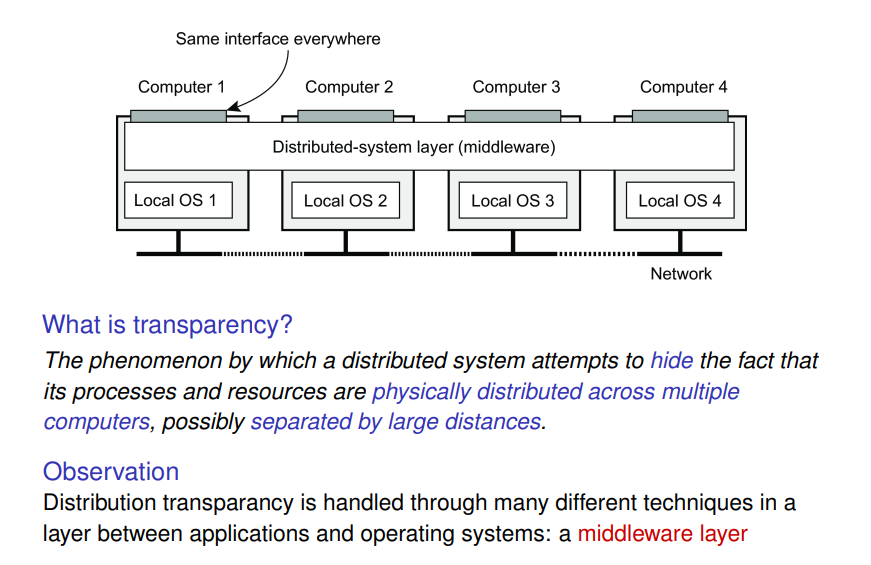
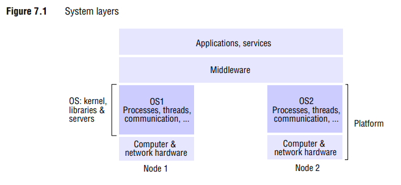
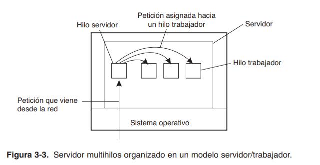
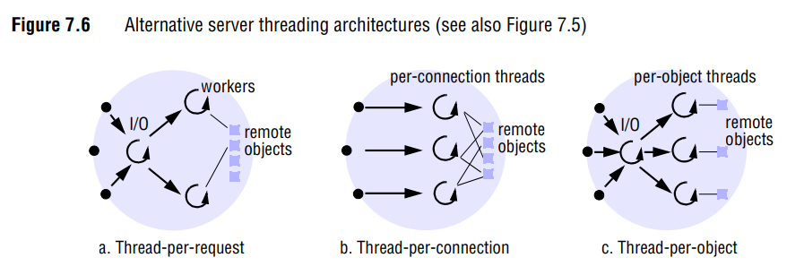

# Programación Distribuida y Tiempo Real - Teoría - Clase 9: Soporte

## Software de soporte
> Coulouris, _Distributed Systems, 5th ed._ p. 280

> Entender objeto remoto como recurso. 

Las tres formas de ver los distintos tipos de software de soporte para las aplicaciones de usuario se suelen identificar por:
- **Sistema Operativo Distribuido o _distributed operating system_ (SOD)**: la visión de tener un único sistema operativo sobre todo el sistema operativo, como si fuera centralizado. El sistema operativo _enmascara_ todas las características del sistema distribuido para hacerlo ver como un sistema único. Entonces, los usuarios nunca se preocupan por dónde se ejecutan los programas o la ubicación de los recursos, existe una única imagen del sistema y el SO tiene control sobre todos los nodos del sistema. 
- **Sistema Operativo de Red o _network operating system_(SOR)**: provee servicios para aplicaciones que pueden ser locales o remotas. El acceso es transparente a la red para algunos tipos de recursos. La característica principal que es tienen es que los nodos que funcionan en un SOR mantienen autonomía para gestionar sus propios recursos. Con un sistema operativo de red, un usuario puede iniciar sesión de forma remota en otra computadora, utilizando, por ejemplo, SSH, y ejecutar procesos allí. Sin embargo, mientras el sistema operativo gestiona los procesos que se ejecutan en su propio nodo, no gestiona los procesos entre los nodos. Existen múltiples imágenes del sistema. 
- Middleware: en general, la capa de software usa servicios de un sistema operativo de red pero los usa de manera tal que se vea de la misma manera desde cualquier sistema (como centralizado). Su tarea es enmascarar la heterogeneidad (masking the heterogeneity) de las redes, hardware, sistemas operativos y lenguajes de programación subyacentes. Ofrece una abstracción de programación uniforme y presenta la vista de un sistema único.

> Sobre _openness_: An open distributed system is essentially a system that offers components that can easily be used by, or integrated into other systems. At the same time, an open distributed system itself will often consist of components that originate from elsewhere.

## Interacción sitema distribuido - aplicaciones de usuario 
El soporte de software se relaciona directamente con la ejecución de procesos e hilos ya que las aplicaciones de usuario se traducen en procesos. 
Los procesos se definen generalmente como un programa en ejecución, donde el sistema operativo utiliza una tabla de procesos para rastrear su estado, mapas de memoria y recursos. Los hilos residen dentro de un proceso.
El objetivo principal de tener múltiples hilos es maximizar el grado de ejecución concurrente entre operaciones. Esto permite el traslape de la computación con las operaciones de entrada/salida (E/S), y habilita el procesamiento concurrente en sistemas multiprocesador.

> El profe en el video indica que soporte de SO está en cap 6 de Coulouris pero si estás usando la 5ta ed está en el capítulo 7. 

### Uso de hilos en clientes 
Para el caso de los navegadores web, el uso de hilos es crucial: traer cada elemento de un documento web el navegador tiene que configurar una coneción TCP/IP, leer los datos de entrada y pasarlos hacia el componente de visualización, entonces, tan pronto como el archivo HTML principal es recuperado, podemos activar hilos separados para que se hagan cargo de la recuperación de las demás partes. Cada hilo configuración una conexión por separado hacia el servidor e introduce los datos. 

### Uso de hilos en servidores 
Para comprender los beneficios de los hilos para escribir código del servidor, consideremos la organización de un servidor de archivos que ocasionalmente se tiene que bloquear en espera del disco. Por lo general, el servidor de archivos espera una petición de entrada para una operación de archivo, posteriormente ejecuta la petición, y luego envía la respuesta de regreso. En la figura 3-3 podemos ver una posible y popular organización en particular. Aquí, un **hilo servidor**, lee las peticiones de entrada para una operación con archivos. Las peticiones son enviadas por clientes hacia un punto final bien conocido por este servidor. Después de examinar la petición, el hilo servidor elige un **hilo trabajador** sin utilizar (es decir, bloqueado) y le agrega la petición.

Esta arquitectura es inflexible porque el número de workers puede ser insuficiente para manejar de forma adecuada la llegada de solicitudes. 

#### Threading Architectures: alternatives
- **Thread-per-request architecture** (Figura 7.6a): el hilo de E/S crea un nuevo worker para cada request y éste se destruye a sí mismo una vez que ha procesado la solicitud. Se tiene la ventaja de que los hilos no compiten por una cola compartida y el rendimiento potencial se maximiza porque el hilo de E/S puede crear tantos hilos worker como solicitudes pendientes existan. Como desventaja se tiene el overhead que genera la creación/destrucción de hilos. Ej. servidor de reqs http 1.0. 
- **Thread-per-connection architecture** (Figura 7.6b) asocia un hilo con cada conexión. El servidor crea un nuevo hilo worker cuando un cliente establece una conexión y destruye el hilo cuando el cliente la cierra (durante, el cliente puede realizar múltiples solicitudes dirigidas a uno o más objectos remotos). Ej.  servidor de reqs http 1.1 en adelante. 
- **Thread-per-object architecture** (Figura 7.6c) asocia un hilo con cada objeto remoto. Un hilo de E/S recibe las solicitudes y las coloca en colas específicas para los hilos worker, pero en este caso, hay una cola por cada objeto.  

> En estas dos últimas arquitecturas, el servidor se beneficia de una menor sobrecarga en la gestión de hilos en comparación con la arquitectura thread-per-request. Sin embargo, su desventaja es que los clientes pueden experimentar retrasos si un hilo "worker" tiene varias solicitudes pendientes mientras otro hilo no tiene trabajo que realizar.

## Emparche de aplicaciones 
En el primer capítulo del libro de Tanenbaum se nos presentan todos los objetivos y beneficios del desarrollo de sistemas distribuidos. Sin embargo en necesario contemplar las trampas para el diseño de sistemas distribuidos. Peter Deutsch, en aquel entonces de Sun Microsystems, formuló estos errores como las siguientes falsas suposiciones que todos hacemos al desarrollar por primera vez un sistema distribuido:
1. La red es confiable.
2. La red es segura.
3. La red es homogénea.
4. La topología no cambia.
5. La latencia es igual a cero.
6. El ancho de banda es infinito.
7. El costo de transporte es igual a cero.
8. Existe un administrador.

Observe cómo estas suposiciones están relacionadas con las propiedades que son únicas para los sistemas distribuidos: confiabilidad, seguridad, heterogeneidad, y topología de la red; latencia y ancho de banda; costos de transporte; y finalmente dominios administrativos.